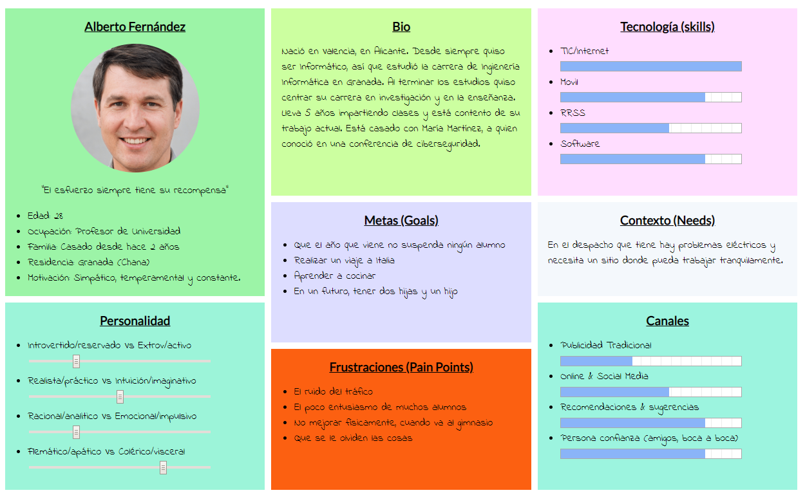

# Trabajo Final

Para el trabajo final he seleccionado la aplicación [erranT](https://www.errant.es/es/)

# Índice
> 1 Análisis de la página actual
> 2 Coworking en la empresa
> 3 Modificaciones
>> 3.1 Modificaciones de funcionalidad
>> 3.2 Modificaciones de diseño

# 1. Análisis de la página actual

Antes de readaptar la página debemos hacer un análisis y ver los mayores problemas de diseño.
La premisa más importante que he aprendido es la de no hacer pensar al usuario, debemos facilitar el uso de la aplicación.
Para hacernos una idea del uso de la aplicación, vamos a suponer que nuestro usuario es Alberto:

## 1.1 Análisis de funcionalidad:

Podemos obserevar que la página no tiene una funcionalidad de reserva o pago de reserva. El únicos elemento
para realizar una reserva es el formulario para ponerse en contacto con la empresa y el idioma no corresponde
con el seleccionado en la página.

Todo esto viene influido porque no tiene una gestión de usuarios, que no permite registrar los datos de los clientes.

El buscador que ofrece la página no ofrece información sobre los datos que se pueden encontrar, resulta ambiguo.
Realizando una búsqueda de un _coworker_ aparece una entrada de blog y ninguna información sobre la persona.

## 1.2 Análisis de diseño:

A simple vista podemos observar una sobrecarga de elementos en las distintas páginas de la web, esto dificulta la navegación,
el interés del usuario y la accesibilidad.
La distribución de los elementos es coherente, aunque se utiliza demasiado espacio para algunos elementos y muy poco para otros,
por ejemplo, las imágenes o el mapa, utilizan un espacio enorme de la página y no aportan una idea importante.
La fuente de texto tiene un tamaño correcto, aunque se podría mejorar con un mayor contraste.
No hay elementos que faciliten una búsqueda entre los diferentes datos de la página, como por ejemplo un buscador sobre una cualidad
de un _coworker_.
El selector de idioma se repite en la pestaña de blogs y aparece una ventana de errores en algunas páginas.
La imagen en 360º es una gran idea para que los usuarios se hagan una idea clara del lugar que van a alquilar.

# 2 Coworking en la empresa

La empresa puede optar por dos tipos de servicio. Por un lado puede ofrecer un servicio más dinámico en el que cualquier persona 
pueda alquilar el servicio de una manera limitada, por ejempo unas horas de un día específico. Por otro lado puede ofrecer un servicio
más familiar donde los clientes utilicen de forma más asidua el espacio alquilado.
Cada opción tiene sus ventajas y desventajas:
> 1. Servicio más dinámico:
>> 1. Necesidad de una plataforma más potente.
>> 2. Mayor número de clientes(con mayor número de clientes se puede subir ligeramente el precio debido a la demanda y las promociones tendrían más peticiones y visualizaciones).
>> 3. Mayor diversidad de gente.
>> 4. Menor unidad de los clientes.
> 2. Servicio más familiar:
>> 1. Necesidad de una plataforma más ligera.
>> 2. Menor número de clientes(que puede suponer clientes más fieles a la compañía, lo que significa una ganancia estable).
>> 3. Menor diversidad de gente.
>> 4. Mayor unidad de los clientes.

Despues de analizar la página, todo indica a que la empresa se enfoca en mayor medida a un servicio más familiar, por lo que enfocaremos
los cambios de acuerdo con esta organización.

# 3 Modificaciones 

Para visualizar mejor los cambios necesarios, se ha realizado un _Capture Grid_ que permita ver con más facilidad los cambios necesarios:

| Interesante/Relevante  | Críticas constructivas  |
| :---: | :---: |
| Permite experimentar un ambiente de trabajo nuevo.  | La imagen 360º es una gran idea para visualizar el local.  |
| Es una buena solución a empresas pequeñas que no tengan gran espacio de trabajo  | La paleta de colores y la fuente son accesibles  |
| El horario del local es el horario laboral tradicional  | Algunos elementos tienen demasiado espacio sin aportar una información relevante  |
|   | El aspecto en diferentes idiomas no es coherente  |
| **Preguntas a partir de la experiencia** | **Nuevas ideas** |
| Alberto: ¿Tengo que enviar un correo para poder reservar?  | Un mapa que muestre la ruta al local  |
| Alberto: ¿Hay algún coworker esperto en IA?  | Que los usuarios puedan añadir entradas de blog personales  |
| Alberto: ¿No tienen más horas de apertura?  | Horarios sin cierre del local  |

La empresa tiene una clara propuesta: alquilar un espacio de trabajo en un ambiente agradable.
Las modificaciones que se realicen no deberán comprometer la propuesta de la empresa.

# 3.1 Modificaiones de funcionalidad

Los cambios de funcionalidad son en su mayoría adiciones al servicio que es capaz de prestar la aplicación.
Una vez terminados los cambios más importantes, será necesario realziar un ajuste en la seguridad y fiabilidad de la web.

[Modificaciones en profundidad](https://github.com/Pmartin97/Ejercicio-DIU/tree/master/funcionalidad)

# 3.2 Modificaciones de diseño

Las modificaciones de diseño se centrarán en reajustes de tamaño y posición de elementos.
También haremos cambios en etiquetas de elementos que pueden ser ambiguos.

[Modificaciones en profundidad](https://github.com/Pmartin97/Ejercicio-DIU/tree/master/dise%C3%B1o)
