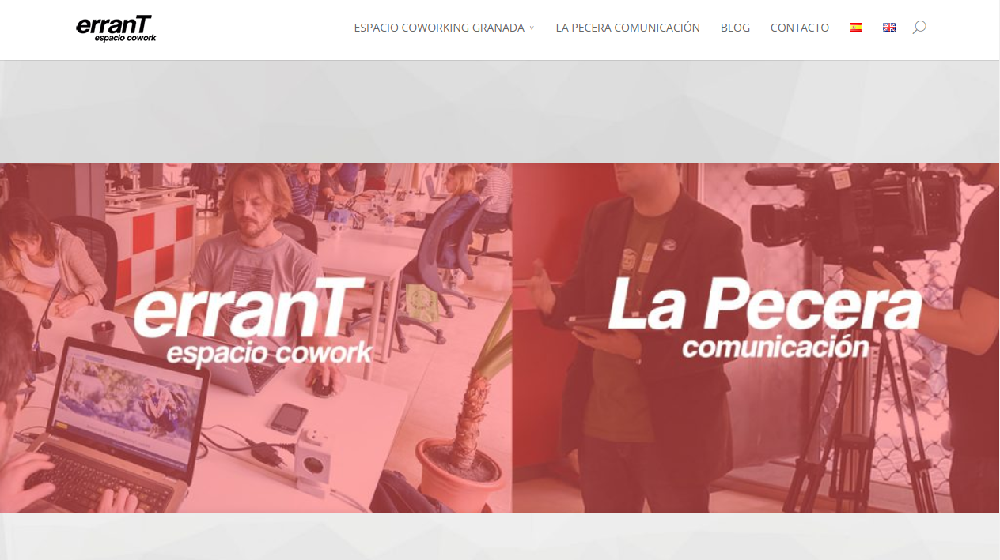
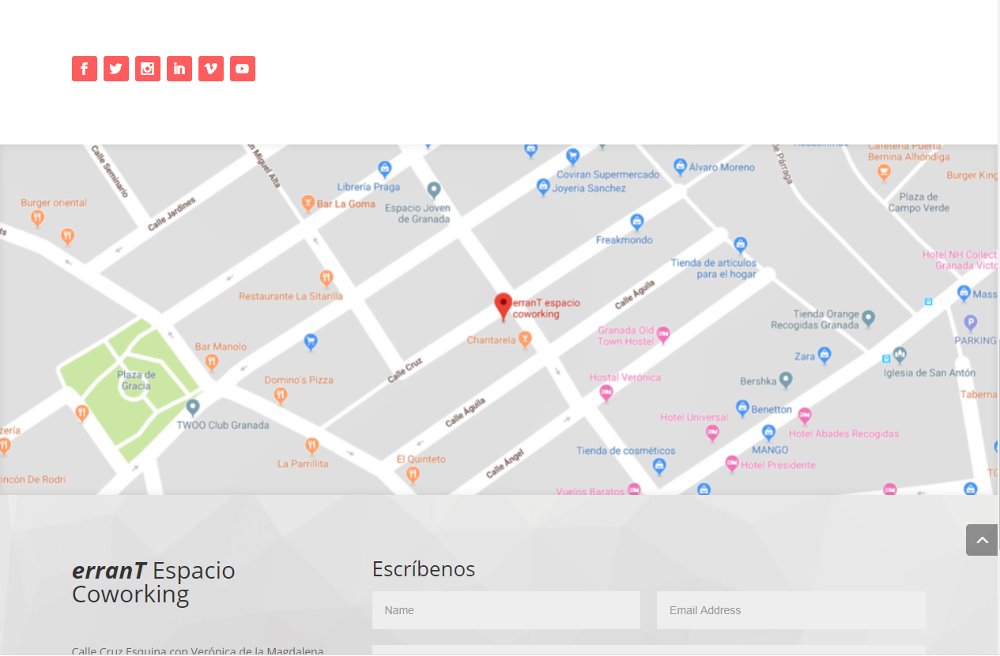
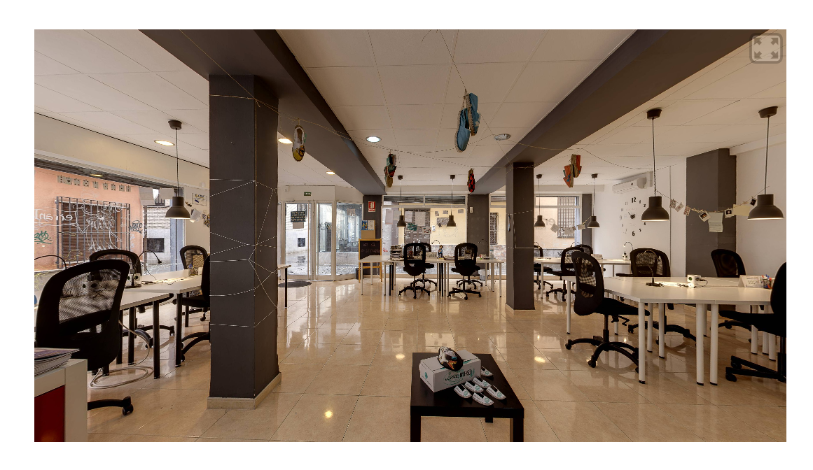
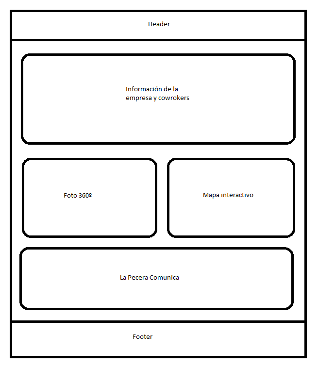

# Análisis de diseño

A simple vista podemos observar una sobrecarga de elementos en las distintas páginas de la web, esto dificulta
la navegación, el interés del usuario y la accesibilidad.
La distribución de los elementos es coherente, aunque se utiliza demasiado espacio para algunos elementos y muy poco para otros,
por ejemplo, las imágenes o el mapa:

Como podemos ver, haciendo una captura de la pantalla completa, sólo podemos ver exclusivamente o una imagen o un mapa,
esto no transmite una idea clara al usuario de lo que puede hacer.

La fuente de texto tiene un tamaño correcto, aunque se podría mejorar con un mayor contraste.
Existen demasiados elementos por página que saturan de información al usuario.

El selector de idioma se repite en la pestaña de blogs y aparece una ventana de errores en algunas páginas.

La imagen en 360º es una gran idea para que los usuarios se hagan una idea clara del lugar que van a alquilar.

Por último la visualización de la versión en inglés, desde ella no se pueden ver los coworkers de la empresa. Las imágenes
utilizan otra paleta de colores, lo que pierde coherencia, en español utiliza el rojo y en inglés un tono en blanco y negro.

# Modificaciones de diseño

En la página principal incluiría los aspectos básicos de la empresa(_cowork_), la localización con un mapa y la imagen 360º en la misma fila
y por último algo de información sobre _La Pecera Comunicación_. Esto permitirá al usuario como Alberto a tener una idea
clara y rápida de todo el sitio web. Un boceto del body low-fi:

En el blog y los coworkers no es necesario ajustar el tamaño si incluimos debajo de la cabecera el buscador mencionado, ya que
la página tiene un buen nivel de accesibilidad, es mejor no realziar demasiados cambios. 
En otro caso, podríamos utilizar el navegador de la derecha en el caso de los blogs para hacer uso del buscador y
opcionalmente, cambiarlo al lado izquierdo. Este esquema lo podemos reutilizar para la página de coworkers para
reutilización de código y sobre todo, mantener una coherencia general del sitio.

Todos estos cambios no requieren de gran tiempo, con la herramienta de Wordpress no tomaría ni una semana a media jornada.
