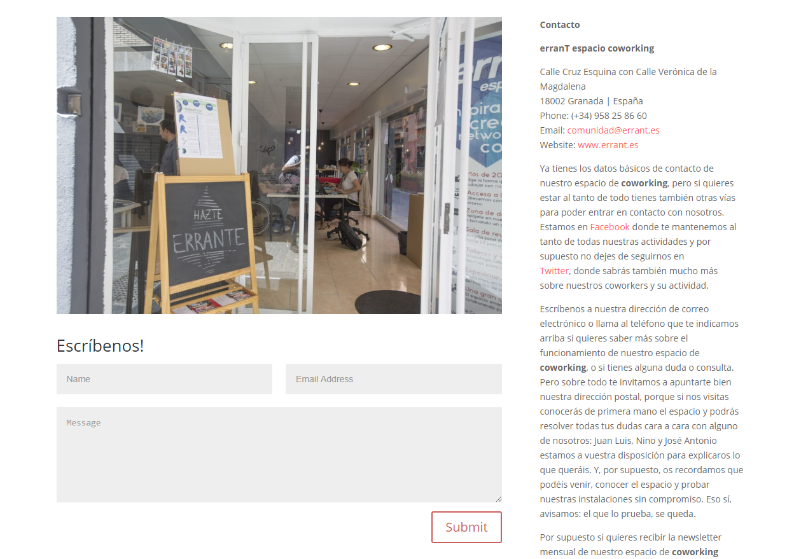
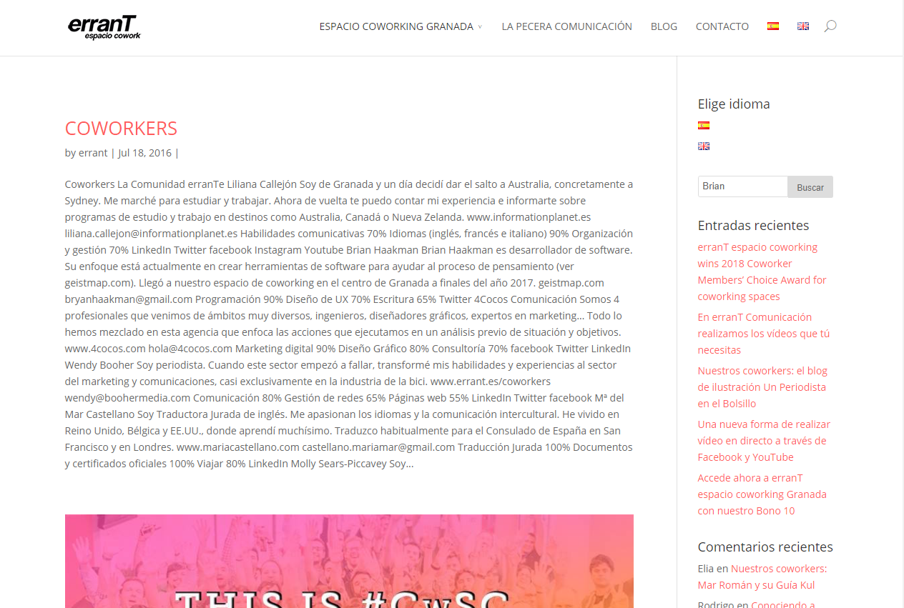
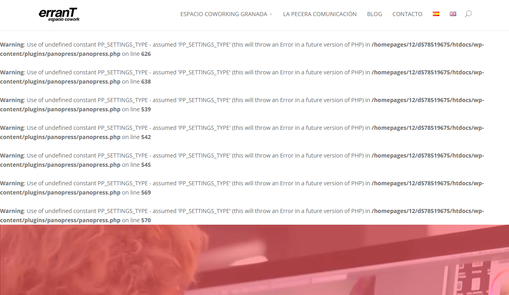
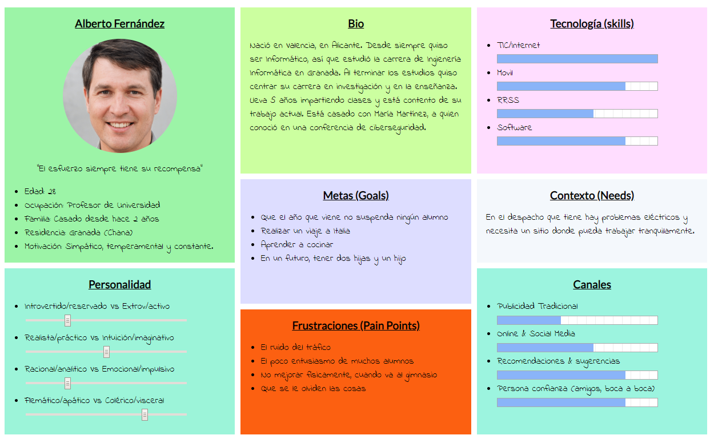

# Análisis de funcionalidad

Podemos obserevar que la página no tiene una funcionalidad de reserva o pago de reserva. El únicos elemento
para realizar una reserva es el formulario para ponerse en contacto con la empresa y el idioma no corresponde
con el seleccionado en la página.

Todo esto viene influido porque no tiene una gestión de usuarios, que no permite registrar los datos de los clientes.

El buscador que ofrece la página no ofrece información sobre los datos que se pueden encontrar, resulta ambiguo.
Realizando una búsqueda de un coworker aparece una entrada de blog y ninguna información sobre la persona.

Podemos apreciar que existen errores tanto en el lado del cliente, viendo la consola de depuración de JavaScript, como en el lado del
servidor, como podemos apreciar incluso en la visualización de la página:

Esto no solo afecta al rendimiento del sitio, si no a la visualización, que deja una mala impresión a los clientes que vean este error.

# Modificaciones en la funcionalidad

La premisa más importante que he aprendido es la de no hacer pensar al usuario, debemos facilitar el uso de la aplicación.
Para hacernos una idea del uso de la aplicación, vamos a suponer que nuestro usuario es Alberto:

## Gestión de usuarios

Independientemente del servicio en el que se cente la empresa, tener una gestión de usuarios permitiría tener un mejor orden de los datos y proporcionar nuevas funcionalidades a la web, por lo que añadiría esta funcionalidad.

Con la gestión de usuarios en marcha, desarrollaría un sistema de reserva y pago para agilizar y automatizar los trámites.

Si Alberto en lugar de tener que enviar una solicitud, puede manejar la reserva automáticamente, sentirá que la experiencia es más satisfactoria y no le importará registrarse en el sitio, ya que puede hacerse una idea del lugar gracias a la imagen en 360º que tiene la web.

## Búsquedas en la página

Es necesario la implementación de un buscador con filtro en los aspectos de blog, coworkers y en las promociones para facilitar la navegación a los potenciales usuarios.
Como hemos visto en la imagen, el buscador existente no proporciona información a los usuarios.  Si Alberto quiere buscar si la empresa cuenta con un coworker especializado en Inteligencia Artificial para ayudarle en una investigación, pero tiene que buscar en una página con 200 entradas, al décimo perfil ya ha abandonado la búsqueda.

Por último, es necesario revisar los errores, no es conveniente que se muestren en la página, puede suscitar vulnerabilidades de la aplicación y si va a gestionar pagos y reservas, la aplicación debe ser totalmente segura y fiable.

Adicionalmente, se hace uso de un mapa para conocer la ubicación del sitio. Se puede hacer un mapa interactivo que indique
cómo se puede llegar al establecimiento.

La web está desarrollada en Wordpress, y todos estos cambios son modificables.

## Errores
 
En una página web con servicio al público es inadmisible que no solo se produzcan errores, si no que puedan llegar a comprometer
la seguridad del sitio. Por ello, es necesario realizar un análisis completo del sitio web y depurar y comprobar todos los posibles
errores

Para la realización de todos estos cambios es difícil dar un tiempo exacto, pero con aproximadamente una semana de trabajo
podría implementarse todos los cambios sin problema, sin tener en cuenta los posibles errores que tenga el sitio web.
